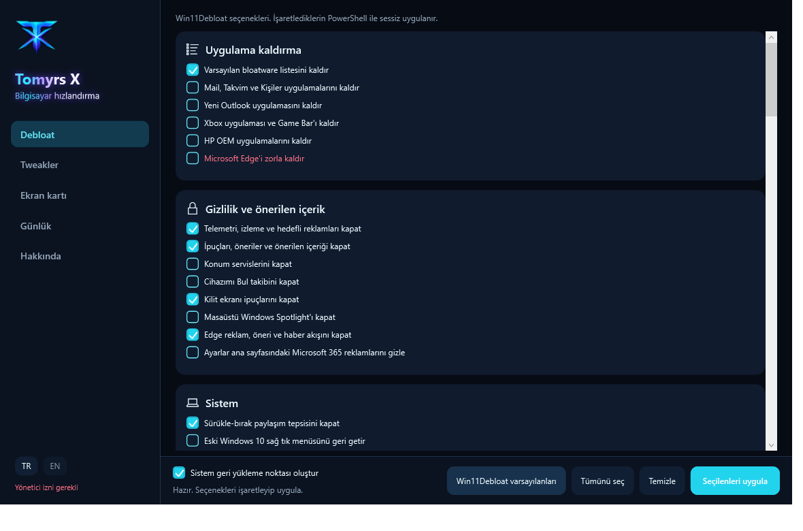
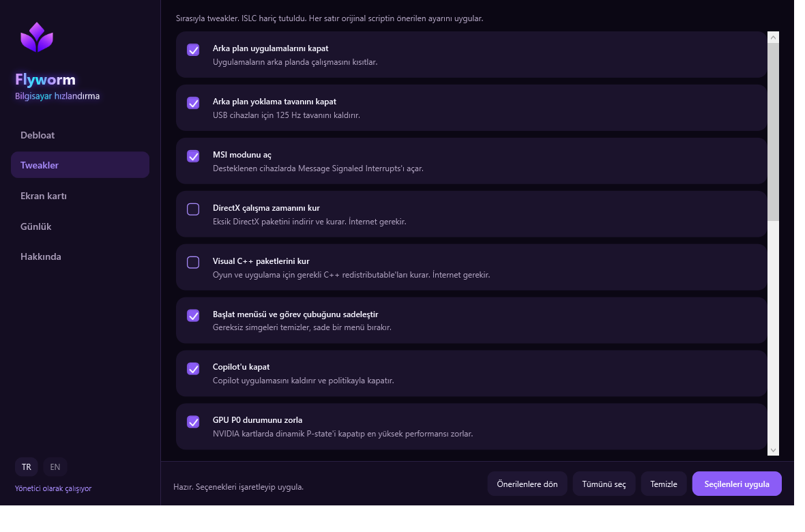
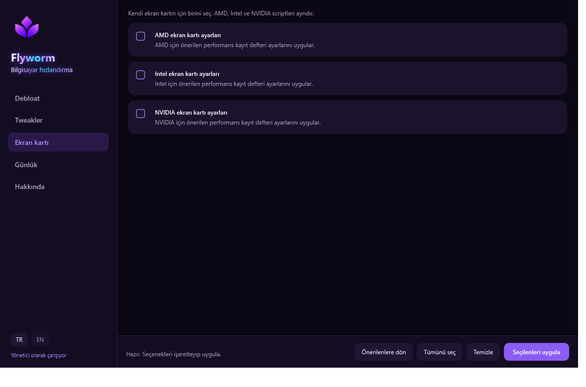
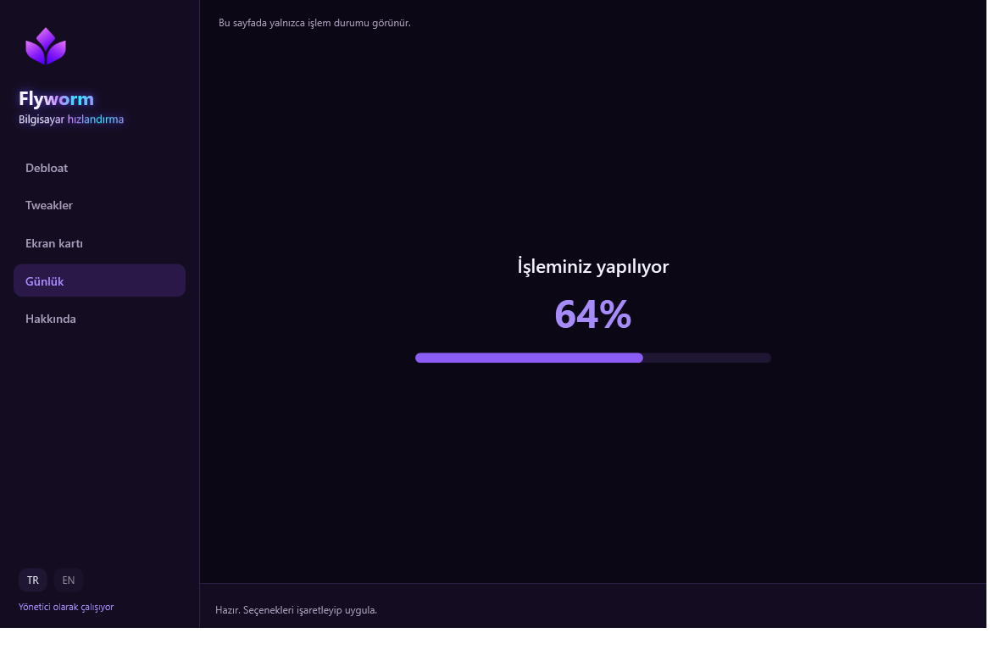
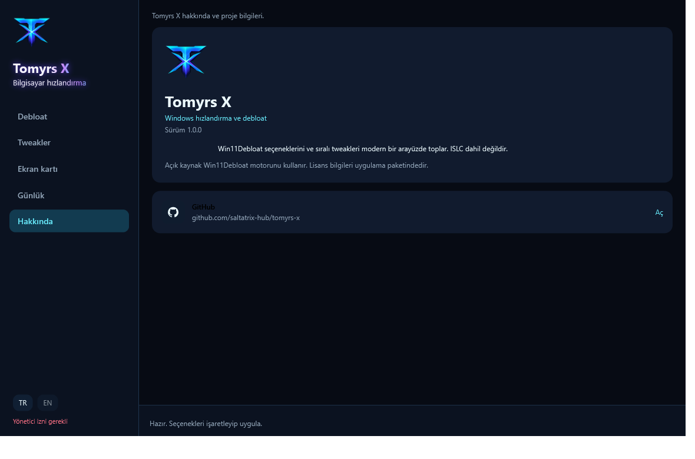

# Flyworm

Windows 11 için **bilgisayar hızlandırma** ve **tweak** uygulaması.

Flyworm, önceden tek tek çalıştırılan PowerShell tweaklerini ve [Win11Debloat](https://github.com/Raphire/Win11Debloat) seçeneklerini tek pencerede toplar.



## İndir

Hazır Windows paketi (yönetici olarak çalıştır):

**[Flyworm 1.0.0 indir (win-x64)](https://github.com/taneryigitxl/flyworm/releases/latest/download/Flyworm-1.0.0-win-x64.zip)**

Zip’i aç, `Flyworm.exe` dosyasına sağ tıkla → **Yönetici olarak çalıştır**. .NET kurman gerekmez. Tweak ve Win11Debloat dosyaları paketin içinde.

Tüm sürümler: [Releases](https://github.com/taneryigitxl/flyworm/releases)

## Ne işe yarar

Windows zamanla arka plan uygulamaları, öneriler, widget'lar, telemetri, gereksiz UWP yazılımları ve düşük güç planlarıyla yavaşlar. Flyworm bunları kategorilere ayırır:

- **Debloat** — bloatware, gizlilik, Copilot, widget, görev çubuğu, Dosya Gezgini
- **Tweakler** — MSI, güç planı, Game Bar, arka plan uygulamaları, tema
- **Ekran kartı** — AMD / Intel / NVIDIA performans kayıt defteri ayarları

**Seçilenleri uygula** yalnızca o anda açık olan sayfadaki işaretleri uygular. Debloat'tayken tweakler çalışmaz.

## Arayüz

| Sayfa | Ne gösterir |
| --- | --- |
| Debloat | Win11Debloat özellikleri, beyaz kategori simgeleri, seçmeli görev çubuğu / arama stilleri |
| Tweakler | Sırasıyla tweak scriptleri |
| Ekran kartı | AMD, Intel, NVIDIA |
| Günlük | PowerShell çıktısı yok; "İşleminiz yapılıyor" + yüzde, bitince **Bitti** |
| Hakkında | [yigittaner.com](https://yigittaner.com), [GitHub](https://github.com/taneryigitxl), [LinkedIn](https://www.linkedin.com/in/taneryigit/) |









## Tweakler

Uygulama, orijinal paketteki sırayı korur ve her satırda önerilen ayarı uygular:

1. Arka plan uygulamalarını kapat
2. USB yoklama tavanını kaldır
3. MSI modunu aç
4. DirectX çalışma zamanını kur
5. Visual C++ paketlerini kur
6. Başlat menüsü ve görev çubuğunu sadeleştir
7. Copilot'u kapat
8. GPU P0 durumunu zorla
9. Widget'ları kapat
10. Oyun modu ayarını aç
11. Game Bar ve Xbox bileşenlerini kapat
12. İşaretçi hassasiyeti
13. Yüksek performans güç planı
14. Kilit ekranını siyah yap
15. Siyah tema
16. Edge ve WebView'ı kaldır
17. Bloatware temizliği
18. Windows Defender'ı kapat (ayrı uyarı)

Edge ve Defender gibi riskli seçeneklerde ikinci bir onay çıkar.

## Debloat ne yapar

Win11Debloat motorunu sessiz çalıştırır. Tipik kazançlar:

- Telemetri, öneriler ve kilit ekranı reklamlarını kapatmak
- Copilot, Recall, widget ve Bing aramasını azaltmak
- Görev çubuğunu ve Başlat menüsünü sadeleştirmek
- Gereksiz uygulamaları kaldırmak

Debloat sayfasında isteğe bağlı **sistem geri yükleme noktası** vardır.

## Kaynaktan çalıştırma

Yönetici olarak:

```powershell
dotnet run --project src/Flyworm.App/Flyworm.App.csproj
```

Tek dosya yayın:

```powershell
dotnet publish src/Flyworm.App/Flyworm.App.csproj -c Release -r win-x64 --self-contained true -p:PublishSingleFile=true -o publish
```

`publish\Flyworm.exe` yönetici ister (.NET 8, Windows 10/11 x64).

## Uyarı

Bazı tweakler Windows Defender, Edge veya sistem bileşenlerini değiştirir. Yalnızca kendi bilgisayarında, riski bilerek kullan. Önce geri yükleme noktası al.

---

# Flyworm (English)

Purple-themed Windows 11 speed-up and tweak app. Default language is Turkish; English is included.

Download: [Flyworm 1.0.0 (win-x64)](https://github.com/taneryigitxl/flyworm/releases/latest/download/Flyworm-1.0.0-win-x64.zip). Extract and run `Flyworm.exe` as administrator.

It wraps Win11Debloat and the sequential tweak scripts in one window. **Apply selected** only runs the current page. The log shows a percentage, not PowerShell output.

Use only on your own PC. Some options turn off Defender or remove Edge.
